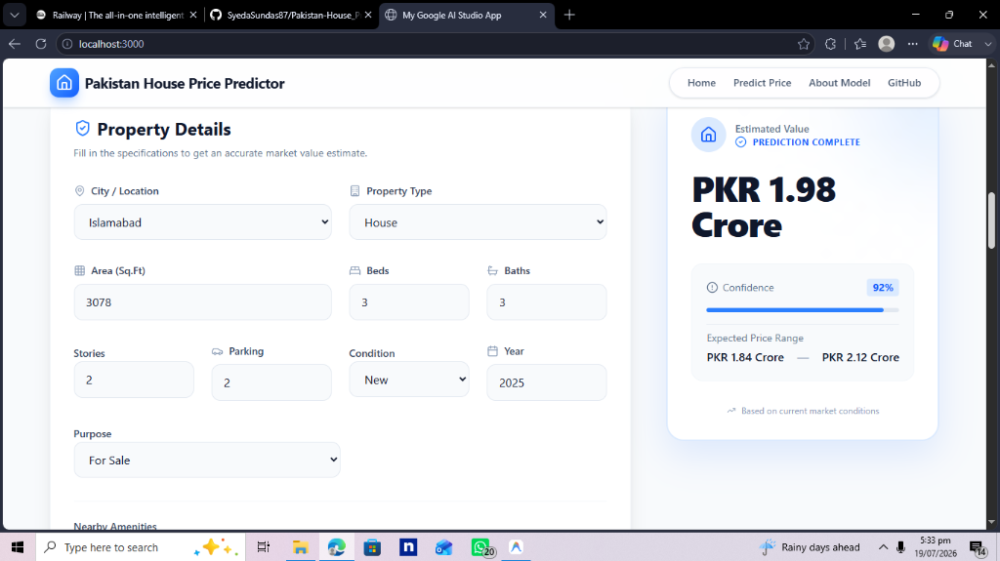

<div align="center">


# 🏡 Pakistan House Price Predictor

**An AI-powered full-stack web application that estimates residential property prices across major cities in Pakistan using a trained XGBoost Machine Learning model.**

[Live Demo](#) · [Report Bug](https://github.com/SyedaSundas87/Pakistan-House_Price_Predecition/issues) · [Request Feature](https://github.com/SyedaSundas87/Pakistan-House_Price_Predecition/issues)

</div>

---

## 📸 App Preview



> *A 3078 sq.ft House in Islamabad with 3 beds & 3 baths predicted at **PKR 1.98 Crore** with 92% confidence.*

---

## ✨ Features

- 🔮 **Real-time AI Predictions** — Instant house price estimates powered by XGBoost
- 🏙️ **10 Major Cities** — Lahore, Karachi, Islamabad, Rawalpindi, Faisalabad, Multan, Peshawar, Sialkot, Gujranwala & Bahawalpur
- 📊 **Market Analytics Dashboard** — Interactive charts for city-wise prices, area vs price trends, feature importance & price distribution
- 📈 **Confidence Score** — Each prediction comes with a confidence percentage & expected price range
- 🎨 **Modern UI** — Responsive design with animations, dark-mode components & glassmorphism styling
- 🐳 **Docker Ready** — Containerized backend for one-command deployment
- 🚀 **Railway Deployable** — Configured for instant cloud deployment

---

## 🛠️ Tech Stack

### Backend
| Technology | Purpose |
|---|---|
| **Python 3.11** | Core language |
| **FastAPI** | REST API framework |
| **XGBoost** | Machine learning model |
| **Scikit-Learn** | Preprocessing & scalers |
| **Uvicorn** | ASGI production server |
| **Joblib** | Model serialization |

### Frontend
| Technology | Purpose |
|---|---|
| **React 19** | UI framework |
| **TypeScript** | Type safety |
| **Vite** | Build tool & dev server |
| **Tailwind CSS v4** | Utility-first styling |
| **Framer Motion** | Animations |
| **Recharts** | Data visualization |
| **Lucide React** | Icon library |

### Deployment
| Technology | Purpose |
|---|---|
| **Docker** | Container packaging |
| **Railway** | Cloud hosting platform |

---

## 🤖 Model Details

| Property | Value |
|---|---|
| **Algorithm** | XGBoost Regressor |
| **Hyperparameter Tuning** | Random Search Cross-Validation |
| **R² Score** | **0.942** |
| **Cross-Validation** | 5-Fold |
| **Training Dataset** | 150K+ property listings (Zameen.com) |
| **Features Used** | 10 (city, property type, province, lat/lon, baths, purpose, bedrooms, area, location frequency) |
| **Output** | Price in Crore PKR |

### Feature Importance
| Feature | Importance |
|---|---|
| Location / City | 45% |
| Area (Sq.Ft) | 30% |
| Bedrooms | 10% |
| Property Type | 8% |
| Condition | 4% |
| Amenities | 3% |

---

## 📁 Project Structure

```
Pakistan-House_Price_Predecition/
│
├── 📂 backend/
│   ├── main.py                    # FastAPI application & prediction endpoint
│   ├── requirements.txt           # Python dependencies
│   ├── Dockerfile                 # Docker container configuration
│   ├── XGBrandom_search.pkl       # Trained XGBoost model
│   └── scaler.pkl                 # Feature scaler
│
├── 📂 pakistan-house-price-predictor/
│   ├── 📂 src/
│   │   ├── 📂 components/
│   │   │   ├── Predictor.tsx      # Main prediction form + result card
│   │   │   ├── Analytics.tsx      # Market analytics charts
│   │   │   ├── Content.tsx        # Hero section + About Model
│   │   │   └── Layout.tsx         # Navbar + Footer
│   │   ├── App.tsx                # Root application component
│   │   ├── main.tsx               # React entry point
│   │   ├── index.css              # Global styles
│   │   └── types.ts               # TypeScript interfaces
│   ├── index.html
│   ├── vite.config.ts
│   ├── tsconfig.json
│   └── package.json
│
├── screenshot.png                 # App preview screenshot
├── .gitignore                     # Protects secrets & binaries
└── README.md
```

---

## 🚀 Getting Started

### Prerequisites
- Python 3.9+
- Node.js 18+
- npm or yarn

### 1. Clone the Repository
```bash
git clone https://github.com/SyedaSundas87/Pakistan-House_Price_Predecition.git
cd Pakistan-House_Price_Predecition
```

### 2. Run the Backend (FastAPI)
```bash
cd backend
pip install -r requirements.txt
uvicorn main:app --reload --port 8000
```

The API will be live at: `http://localhost:8000`
Interactive API docs: `http://localhost:8000/docs`

### 3. Run the Frontend (React)
Open a new terminal:
```bash
cd pakistan-house-price-predictor
npm install
```

Create a `.env` file from the example:
```bash
cp .env.example .env
```

Start the development server:
```bash
npm run dev
```

The app will be live at: `http://localhost:3000`

---

## 🔌 API Reference

### `POST /api/predict`

Predict the house price based on property details.

**Request Body:**
```json
{
  "location": "Islamabad",
  "area": 3078,
  "bedrooms": 3,
  "bathrooms": 3,
  "propertyType": "House",
  "purpose": "For Sale"
}
```

**Supported Cities:** `Lahore`, `Karachi`, `Islamabad`, `Rawalpindi`, `Faisalabad`, `Multan`, `Peshawar`, `Sialkot`, `Gujranwala`, `Bahawalpur`

**Supported Property Types:** `House`, `Flat`, `Upper Portion`, `Lower Portion`, `Farm House`

**Response:**
```json
{
  "price": "PKR 1.98 Crore",
  "confidence": 92,
  "rangeLow": "PKR 1.84 Crore",
  "rangeHigh": "PKR 2.12 Crore"
}
```

### `GET /health`

Health check endpoint.

```json
{
  "status": "ok",
  "model_loaded": true
}
```

---

## 🐳 Docker Deployment

Build and run the backend with Docker:

```bash
cd backend
docker build -t pakistan-house-price-api .
docker run -p 8000:8000 pakistan-house-price-api
```

---

## ☁️ Deploy on Railway

1. Fork this repository
2. Create a new project on [Railway](https://railway.app)
3. Connect your GitHub repository
4. Set the **Root Directory** to `backend/`
5. Set the environment variable:
   ```
   ALLOWED_ORIGINS=https://your-frontend-domain.com
   ```
6. Railway will auto-detect the `Dockerfile` and deploy

---

## 🔒 Security

- **Secrets are never committed** — `.env` files and API keys are excluded via `.gitignore`
- **CORS is configurable** — Set `ALLOWED_ORIGINS` environment variable to restrict access in production
- **Input validation** — All inputs are validated server-side using Pydantic models

---

## 📊 Market Insights (Modeled Data)

| City | Avg Price (Crore PKR) |
|---|---|
| Islamabad | 5.10 |
| Karachi | 4.20 |
| Lahore | 3.50 |
| Rawalpindi | 2.80 |
| Faisalabad | 2.10 |
| Multan | 1.80 |

---

## 🤝 Contributing

Contributions are welcome! Here's how:

1. Fork the repository
2. Create your feature branch: `git checkout -b feature/AmazingFeature`
3. Commit your changes: `git commit -m 'Add some AmazingFeature'`
4. Push to the branch: `git push origin feature/AmazingFeature`
5. Open a Pull Request

---

## 📄 License

This project is open source and available under the [MIT License](LICENSE).

---

## 👩‍💻 Author

**Syeda Sundas**

[](https://github.com/SyedaSundas87)

---

<div align="center">

Made with ❤️ for the Pakistani real estate market

⭐ If you found this project helpful, please give it a star!

</div>
